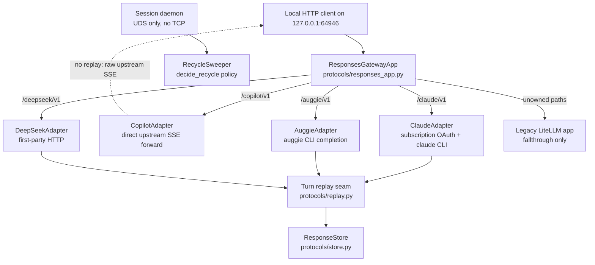

# Concept Map - Responses Gateway

How the first-party Responses gateway fits together. Vocabulary follows `CONTEXT.md` (domain) and the ADRs (decisions).

## Concepts

| Concept | Where | One-line definition |
|---|---|---|
| Provider adapter | `protocols/adapters/` | Concrete implementation of the frozen `ProviderAdapter` Protocol (`adapter.py`, ADR 0002 11.3) for one upstream provider |
| Buffered turn | claude, auggie, deepseek adapters | The provider returns the whole completion at once; streaming is synthesized afterwards |
| Turn replay | `protocols/replay.py` | Replays a buffered turn as the canonical 9-event Responses SSE sequence |
| Store before drain | `replay_turn` | The response envelope is stored before the first SSE event is yielded, so a client disconnect cannot lose the turn |
| Response store | `protocols/store.py` | In-memory map of response id to envelope and recorded input items; enables `previous_response_id` chaining |
| Single-port composition | `proxy/compose.py` | ResponsesGatewayApp is composed in front of the legacy LiteLLM app on one port (ADR 0003); LiteLLM serves only unowned paths |
| Recycle policy | `daemon/recycler.py` | Pure `decide_recycle`: recycle iff idle at least the threshold AND the descendant probe reports no live children |

## Invariants worth knowing

- The `ProviderAdapter` Protocol is frozen; new behavior goes into adapters or the replay seam, never into the interface.
- Copilot does NOT go through turn replay; it forwards upstream SSE bytes as-is.
- The canonical event sequence and the store-before-drain invariant are tested once at the seam (`tests/unit/test_replay.py`), not per adapter.
- The daemon never opens TCP; the gateway binds 127.0.0.1:64946 only.
